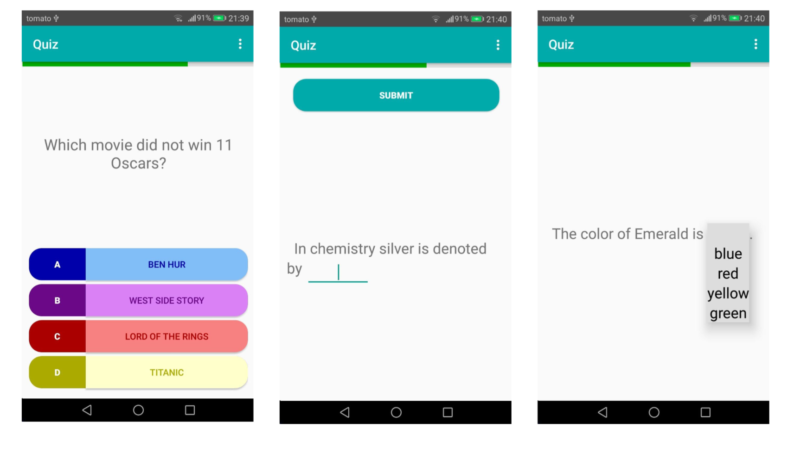

⚠️ Note: This project was developed as a student assignment, and the code may not follow current best practices. 
🤝 Collaboration with Dajana Jerončić, Mihaela Gamulin, Luka Valenta  
📅 Date: 2018  

## Student project for the course "Programiranje za suvremene procesore" at PMF Zagreb, 2018./2019.

## 📱 Android-Quiz

This project is a quiz application featuring multiple categories and difficulty levels.

To start using the application, users must:
- create a user account  
- confirm their registration via email  
- log in to the application  

After the initial login, users are not required to enter their credentials again when reopening the app.  
Registration-related data is stored in a database on the server.

---

## 🎯 Features

- Multiple categories (e.g., sports, animals, mathematics, general knowledge...)
- Multiple levels within each category
- Unlocking the next level after correctly answering all questions
- Progress tracking across all categories
- Top 10 leaderboard (retrieved from the server)
- Local database for storing quiz questions
- Four answer options per question
- Time limit for each question
- Available in Croatian and English

